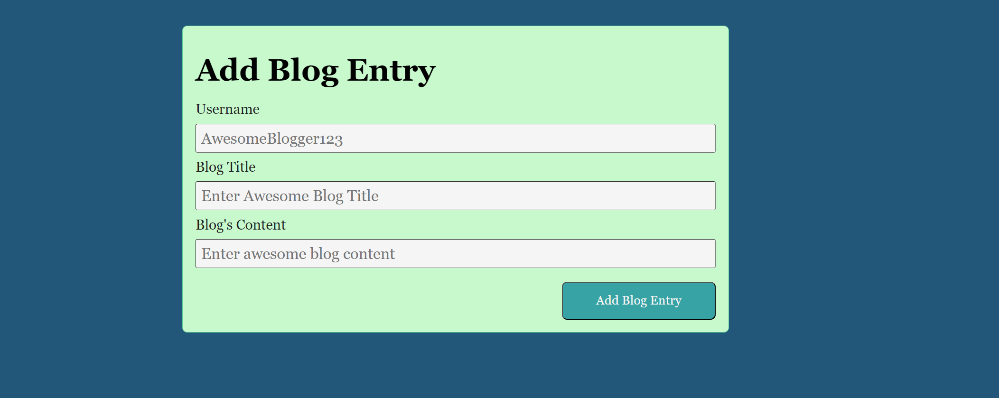
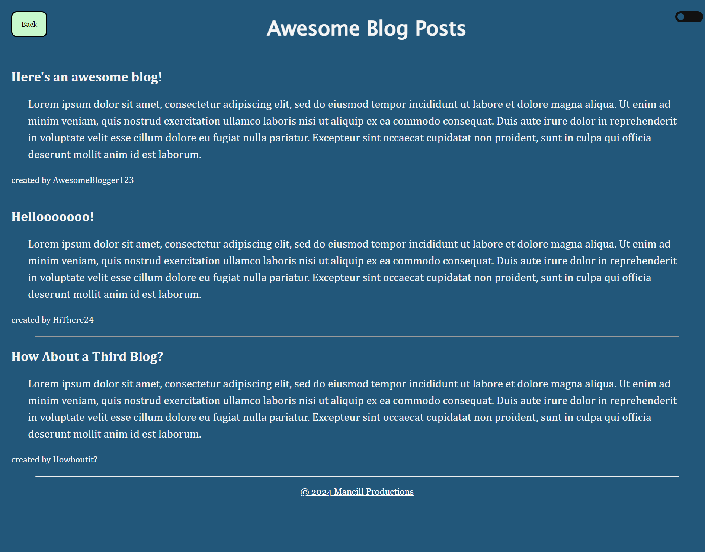
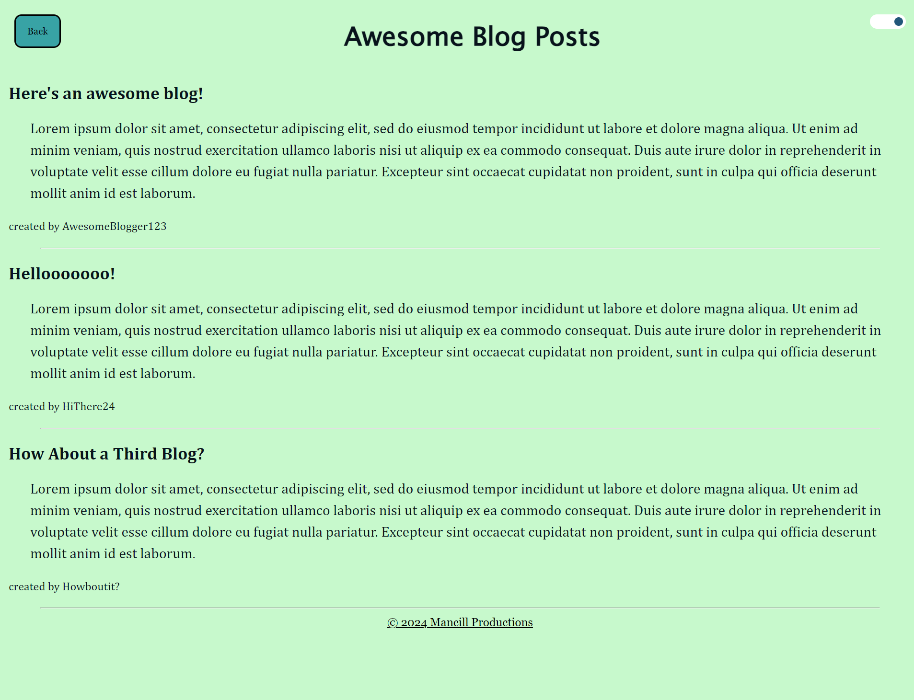

# Web APIs Challenge: Personal Blog

This is a two-page website where users can input and view blog posts. It includes a content form that dynamically renders blog posts and a light/dark mode switch. 

When the app is loaded, the user is presented with a landing page containing a form with labels and inputs for username, blog title, and blog content. When the form is submitted, the blog post data is stored to local storage and the user is redirected to the posts page. If the user tries to submit a form without a username, title, or content, they are prompted to complete the form.

On the posts page, the user is presented with a header, a light mode/dark mode switch, and a "Back" button. Clicking the light mode/dark mode switch causes the page content's styles to update to reflect the selection. When the user clicks the "Back" button, they are redirected back to the landing page where they can input more blog entries. The main content of the posts page is a list of blog posts pulled from localStorage. Each post contains the title, the content, and the author of the post. When local storage is viewed, the user is presented with a JSON array of blog post objects, each including the post author's username, title of the post, and post's content. The footer contains a link to my portfolio.

This application includes 8 files in addition to this read me. To help keep track of the functions of each, I have listed their titles and purpose below. I have also added comments at the top of each of the .js and .css files.

index.html - defines structure for the form
blog.html - defines structure for the blog posts page
blog.js - functionality of the blog posts page
form.js - functionality of the form
logic.js - functionality of the light mode/dark mode switch and the back button on the blog posts page
blog.css - styling for the blog posts page
form.css - styling for the form
styles.css - styling for the light mode/dark mode switch and the back button on the blog posts page

URL of deployed site: mancillh.github.io/Personal-Blog

Screenshots:

